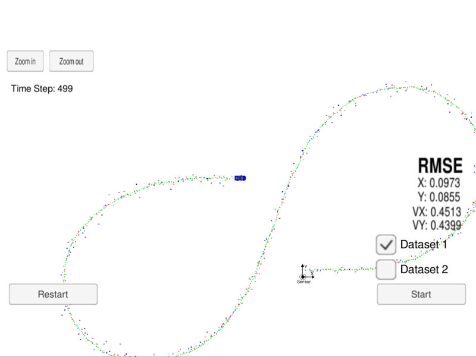
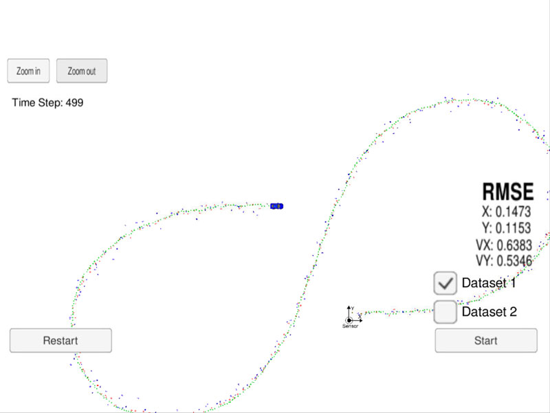
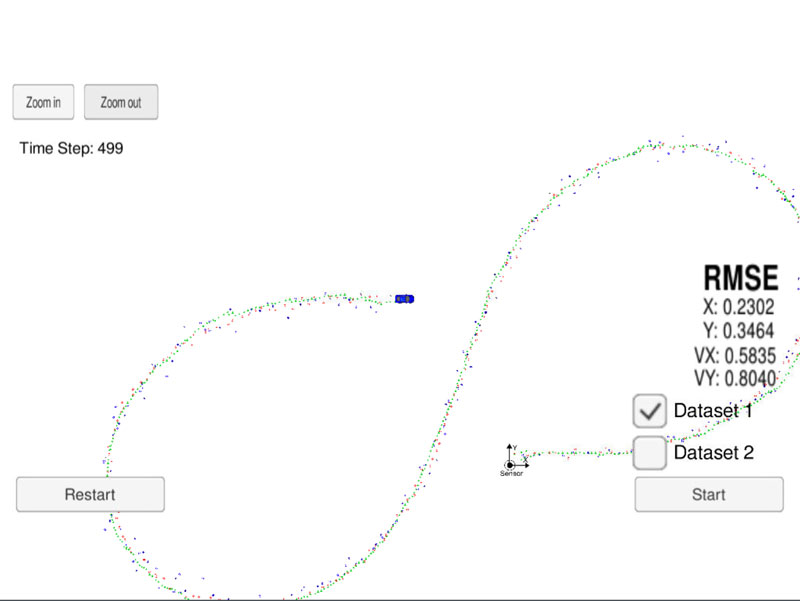

## Self-Driving Car Engineer Nanodegree Program
# Project: Implementation of an Extended Kalman Filter using C++

## 1. Introduction

In this project I've implemented an Extended Kalman Filter in C++. The simulator provides the script the measured data (either lidar or radar), and the script feeds back the measured estimation marker, and RMSE values from its Kalman filter. I implemented a sensor fusion which combines lidar and radar measurements to track the bicycle's position and velocity.

 
## 2. Project Environment

The project consists of the following files:

* [main.cpp] - the main protocol that main.cpp uses for uWebSocketIO in communicating with the simulator.
* [FusionEKF.cpp] - Initialization of Extended Kalman Filter object state. Call Predict(), Update() or UpdateEKF() depending on incomming data from radar or lidar.
* [kalman_filter.cpp] - Kalman Filter Predict(), Update() and UpdateEKF() methods for prediction and radar & lidar updates. 
* [tools.cpp] - Methods to calculate Jacobian and RMSE values.

In order to run the project uWebSocketIO should be installed.
This project involves the Term 2 Simulator which can be downloaded [here](https://github.com/udacity/self-driving-car-sim/releases)

The main program can be built and run by doing the following from the project directory.

1. cmake .
2. make
3. ./ExtendedKF

### Important Dependencies

* cmake >= 3.5
  * All OSes: [click here for installation instructions](https://cmake.org/install/)
* make >= 4.1 (Linux, Mac), 3.81 (Windows)
  * Linux: make is installed by default on most Linux distros
  * Mac: [install Xcode command line tools to get make](https://developer.apple.com/xcode/features/)
  * Windows: [Click here for installation instructions](http://gnuwin32.sourceforge.net/packages/make.htm)
* gcc/g++ >= 5.4
  * Linux: gcc / g++ is installed by default on most Linux distros
  * Mac: same deal as make - [install Xcode command line tools](https://developer.apple.com/xcode/features/)
  * Windows: recommend using [MinGW](http://www.mingw.org/)

## 3. Results

The following RMSE values has been achived using Extended Kalman Filter which combines lidar and radar measurements: 
X: 0.0973
Y: 0.0845
VX: 0.4513
VY: 0.4399

The following image shows the result in the simulator for Dataset 1 using combined lidar and radar measurements:

Result with fused LIDAR & RADAR measurements
:------------------------------------------------:

The images below show that only lidar or radar measurements give much less position accuracy then can be achived combining data from both sensors:

Result lidar data          |  Result with radar data
:-------------------------:|:-------------------------:
  |    

The EKF generate more accurate estimation of the object position.

